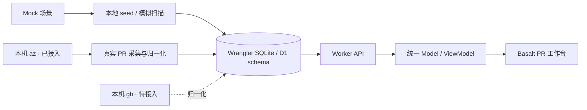

# 10 — PR 工作台与 Mock 预览

> 2026-09-17 · 本地 UI 预览已实现。Basalt 清理基线 `1dd22e3` 已推送；本阶段没有部署或写入远端 D1。

后续真实 ADO 接入、仓库范围与采集恢复已在 [11 — 真实 PR 采集](11-真实PR采集与本地工作台.md) 实现。本文记录示例场景与最初的 Mock 验收；当前新增项目使用真实来源，示例扩展为 ADO 和 GitHub 两种组织结构。

## 当前进度

| 工作项 | 状态 |
| --- | --- |
| Basalt 控件、主题、布局清理与独立审查 | 完成，清理版已推送 |
| Provider-neutral PR 契约与就绪判定 | 完成 |
| 本地 Wrangler D1 migration 与 Mock 数据 | 完成：5 项目、13 仓库、46 PR |
| ADO 项目增删改查、暂停 / 恢复 | 完成 |
| 跨项目 PR 队列、搜索、筛选、分页 | 完成；全局来源、三级范围、Draft / 作者筛选与本地缓存，每页 20 个 |
| PR 详情、评审、policy、build / stage、活动 | 完成 |
| 模拟扫描、扫描历史、可配置自动刷新（默认 2 分钟） | 完成；进度写入本地库 |
| 真实 ADO PR / policy / timeline 采集 | 已完成本地接入，见 11 |
| GitHub `gh` 接入 | 后续阶段 |
| issue / ADO work item 工作台 | 后续阶段 |

## 数据从哪里来，存在哪里

Sample 来源为 `packages/domain/src/demo.ts` 中可重复生成的虚构场景。`scripts/seed-demo.ts` 将它们写入本地 D1；浏览器从 Worker API 读取数据库，没有把 PR 列表硬编码在 View 中。Live 来源由本机采集器提供，使用相同的表结构。



- 本地数据库文件：`.wrangler/state/v3/d1/miniflare-D1DatabaseObject/*.sqlite`，不提交 Git。
- 初版 SQL migration：`packages/db/migrations/0011_pr_workbench.sql`；当前 schema version 14，包含真实采集任务、当前页 PR 范围与项目 Readiness 设置。
- `projects`：provider、organization、project key、名称、负责人、监控开关、revision 和最近扫描信息；`readiness_rules_json`、`readiness_revision` 独立保存排序与颜色。
- `pull_requests`：项目 / 仓库 / 外部 ID 索引与统一 PR snapshot JSON。
- `scan_runs`：扫描时间、结果、PR 数量、推进阶段数和说明。
- 删除项目会级联删除其 PR 和扫描历史；变更源 organization / project 时清除旧快照。

读模型接受 `ado | github`，项目创建 / 编辑当前只开放 `ado`。每个来源进入相同的 Project、PullRequest、Policy、Build、BuildStage、Review 结构。真实 PR 采集使用 11 中独立的队列与快照发布接口，现有 Activity ingest 接口不能直接接收这种快照。

## 本地启动

从仓库根目录执行：

```bash
bun install --frozen-lockfile
bun run build:web
bun run db:migrate:local
bun run db:seed:local
bun run dev:worker
```

另开终端执行 `bun run dev`，通过本机 Caddy 域名 `https://signoff.dev.hexly.ai` 访问。

Worker 开发脚本固定本地 upstream，并开启 `SIGNOFF_DEMO_MODE=1`。模拟扫描同时检查本地域名、Demo 开关、项目 source 和监控开关，不能修改 CLI 来源的快照。生产不设置此开关。

再次运行 `db:seed:local` 会重置五个指定 Demo 项目及其 PR / 扫描历史，恢复完整演示场景；保留其他项目与原来的活动分析数据。该命令不接受参数，也没有远端写入选项。

## UI 与场景

PR 工作台位于 `/prs`（`/` 自动跳转），`/projects` 为项目管理，原 Dashboard 位于 `/insights`。来源、三级范围、搜索、Draft、作者多选、PR 状态、readiness、Watched 筛选以及排序字段和升降序保存在 URL 与 `signoff-pull-filters` localStorage。刷新保留当前选项，直接打开无筛选参数的 `/prs` 或 `/` 恢复上次偏好，并以 replace 写回 URL；明确的筛选链接优先于缓存，前进后退恢复对应历史条目的筛选。状态机、详情及其他页面的访问不会覆盖列表偏好，从侧栏返回 Pull requests 会恢复它们；主动切换全局来源仍保留通用筛选，清空来源相关的范围与作者。分页使用 `page` 参数，PR 详情使用资源路径（见 [浏览器 URL 约定](19-pr-state-machines.md)），这些临时位置不写入筛选缓存。

各页面使用 Basalt PageHeader 的主标题、次标题与全局 AppHeader 面包屑，分类名称无跳转目标时不可点击。PR 页主标题为 Pull requests，次标题显示当前组织 / 项目 / 仓库；移除重复仓库横幅，筛选后的状态数量保留在汇总区。Live 列表与当前页检查使用独立刷新队列，默认完成整轮后冷却 2 / 5 分钟，见 11。

初始数据有 36 个 open PR（含 5 draft），默认排除 Draft 后显示 31 个：18 个需要处理、6 个构建中 / 排队中、7 个可合并；另有 6 个 merged、4 个 closed。ADO 按组织 / 项目 / 仓库筛选，GitHub 示例按 `github.com / nocoo / signoff.now` 筛选。

| 项目 | 示例 PR | 可观察的情况 |
| --- | --- | --- |
| Core Platform | #4821 | Unit tests 失败、Integration 跳过，同时另一个 build 的 Windows stage 正在运行 |
| Core Platform | #4822 | 构建基本完成，Staging 等待负责人批准 |
| Core Platform | #4824 | 所有必需检查通过，但仍有 merge conflict |
| Core Platform | #4828 | 两个 advisory 检查失败，其余条件满足，仍可合并 |
| Commerce | #2165 | 构建被取消，下游 stage 未执行，需要重新运行 |
| Commerce | #2166 | 指定必需 reviewer 尚未批准 |
| Commerce | #2168 | 构建与评审均完成，只剩 Proof Of Presence 必需 Policy；默认按原始失败状态显示，可在项目 Readiness 中手动配置；描述包含 Markdown 表格与任务清单 |
| Developer Experience | #907 | Unit tests 正在运行，后续 Integration 排队 |
| Developer Experience | #915 | 部分 build timeline 缺失；重扫后恢复 |
| Mobile Apps | #1530 | reviewer 请求修改，即使 build 通过也不能合并 |
| nocoo / signoff.now | #101–#108 | GitHub Actions 失败、运行、环境审批、待评审、可合并、草稿与终态 |

表格一行展示 PR 身份、当前就绪程度、必需检查计数、全部 stage 进度、下一步、负责人和更新时间。人名前显示圆形双字母头像，编号链接在新标签页打开源 PR。表头可按标题、Readiness、检查完成比例、下一步和更新时间双向排序；默认按各项目配置的 Readiness 顺序从最就绪开始，同级按最近更新排序。点开 PR 查看 Overview、Checks & builds、Activity；每个 build 可展开全部 stage、时长、说明与负责人。

预置项目可以模拟扫描，让各 build 的一个可运行阶段从 queued → running → passed，并恢复不完整的示例 timeline。草稿与终态 PR 不推进；失败、冲突、待评审、必需 Policy 和环境审批继续保留。当前新增项目初始为空，第一次扫描使用真实 ADO 采集。

Projects 的 Readiness 按钮或已选项目 PR 列表中的 Readiness order 打开设置，列出实际 merge requirements，从先解决排到最后步骤，拖拽或上下箭头调整位置、名称和颜色。同类型同名 policy 合并成一行，全部原始评估通过才算整组通过；CI 按 pipeline 区分。一个 PR 同时有多个未完成要求时，采用列表中第一个未完成项；越接近最后步骤的 PR 越靠前。已通过、advisory、草稿和终态事实保持原含义。无 PoP 特例，ADO 与 GitHub 示例共用规则。

Sample 模拟扫描成功后才改变示例进度。Live 的列表队列在后台继续发现 PR，检查队列只采集前台当前页全部 PR，见 11；关闭自动刷新不会丢失数据库状态。

## API 与并发

| 方法 | 路径 | 行为 |
| --- | --- | --- |
| GET | `/api/workbench` | 一次 D1 batch 读取项目、PR 与最新 20 条扫描记录，`Cache-Control: no-store` |
| POST | `/api/projects` | 创建 ADO 项目，server 决定 `source` 与初始 revision |
| PATCH | `/api/projects/:id` | 携带 revision 的部分更新，冲突返回 409 |
| PATCH | `/api/projects/:id/readiness` | `{ revision, rules }`；独立 Readiness CAS，`rules: []` 恢复默认，不改变采集 revision |
| DELETE | `/api/projects/:id` | JSON body `{ revision }`，级联清理项目快照 |
| POST | `/api/projects/:id/scan` | 本地 Demo 扫描，JSON body `{ revision }` |

源变更时，依赖删除使用旧 revision 守卫并在 CAS 更新前执行；扫描时每条写入使用同一旧 revision 守卫，最后更新版本。D1 batch 只因语句报错回滚，不能依赖零行更新隐式回滚。

一次 workbench 读取最多 1,000 个 PR，超过时返回 `truncated` 并在页面说明计数范围。单项目 Demo 扫描最多 40 个 PR，以控制 D1 语句预算。真实大型项目接入时需要加入服务端分页与采集任务调度。

原 machine-token 路由白名单没有增加这些管理 API。批量扫描按项目顺序执行，部分失败会继续其他项目，并明确报告成功数量与失败原因。前端拒绝重复提交，旧请求与卸载后的请求不能覆盖较新的快照。

## 验收

- [x] Domain：就绪判定、可选失败、必需评审、未知状态、模拟阶段推进与终态保护。
- [x] Worker + SQLite：项目 CRUD、大小写不敏感的源唯一性、revision 冲突、源变更回滚、扫描原子性、机器入口限制。
- [x] Web：筛选 / 排序 / 分页、URL 状态、HTTP 契约、表单校验、刷新失败、过期响应、卸载、重复提交和可见性轮询。
- [x] Chromium + 实际本地 API：新增项目 → 扫描 → 再扫描推进阶段 → 刷新确认持久化 → 编辑 → 暂停 / 恢复 → 删除。
- [x] 浏览器确认 conflict 不被全绿 checks 覆盖，advisory 失败不阻止可合并状态。
- [x] 桌面、390px 窄屏、明暗主题、导航、详情 tab、完整 stage 列表与对话框关闭后的焦点恢复。

初版 Mock 验收时，前端 412 个测试通过，Model / ViewModel / lib 行覆盖率 99.8%。提交仍执行仓库原有覆盖率、Biome 与类型检查门禁。

## 下一步

真实 ADO 接入与按页采集已完成，见 11。之后通过 `gh` 接入 GitHub 的 PR、review 和 check runs，并保留无法确定的状态。issue / work item 页面另立阶段。
