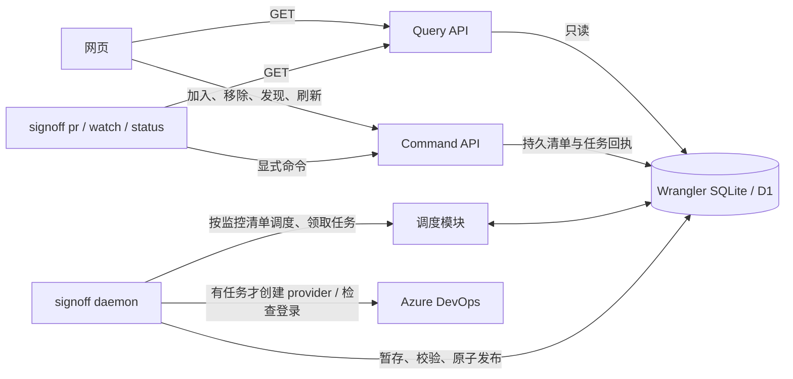

# 14 — 共享 PR 监控清单、调度与缓存查询

> 当前实现，2026-09-18。网页与 CLI 共用持久监控清单；首次启用时清单为空，后续升级保留已有关注项；发现只由明确命令触发。

## 职责与运行边界

SignOff 将“发现候选 PR”“持续监控选定 PR”“查询已有状态”分开。网页和其他项目使用同一个本机 Worker；短命 CLI 只查询缓存或提交命令，常驻 `signoff daemon` 领取并执行后台任务。停止网页不会停止监控；停止 daemon 后，缓存仍可查询。

刷新模块不决定哪些 PR 值得关注，也不会定时发现项目。注册仓库、打开页面、分页、筛选、GET、空清单 daemon 均不调用 provider。`discover` 显式入队，包含 Draft、Completed 和 Abandoned：首次覆盖全部可访问历史，后续按仓库成功边界增量发现；`--full` 可重新核对旧历史。结果不会自动加入监控。

ADO 真实采集已接入。GitHub 使用同一规范身份与 Sample 数据，但本期没有真实 GitHub 工作台采集。原有 Activity / Score 和 `pulse` 保持独立用途。

## 实现位置

| 模块 | 代码 | 责任 |
| --- | --- | --- |
| 身份与 DTO | `packages/domain/src/monitoring.ts`、`query.ts` | provider / org / project / provider repo ID / PR number；UTC 时间与来源 |
| 清单命令 | `packages/worker/src/monitoring/observations.ts` | 引用解析、幂等加入、generation 删除、显式发现和刷新 |
| 调度 | `packages/worker/src/monitoring/scheduler.ts` | 独立状态 / 检查通道、完成后冷却、租约、认证退避、跨项目并发 |
| 发布 | `packages/worker/src/monitoring/publication.ts` | 按事实时间合并暂存、数量与版本校验、有界竞争重试、原子发布与终态淘汰 |
| 查询 | `packages/worker/src/monitoring/query.ts` | SELECT 批次与 source 版本校验、服务端过滤 / 排序 / 分页、共享 readiness |
| HTTP | `packages/worker/src/routes/query.ts`、`commands.ts`、`collection.ts` | 输入校验与薄适配器；不访问 ADO |
| CLI | `apps/collect/src/workbench/commands.ts`、`query-client.ts`、`run.ts` | 短命查询 / 命令客户端与常驻执行器 |
| 网页 | `monitoringApi.ts`、`useQueryBlock.ts`、`useWorkbenchViewModel.ts` | 独立请求生命周期、临时多选与持久清单操作 |

模块使用现有 TypeScript 函数和 D1，没有第二个 HTTP 端口或独立内存真相源。Query 不依赖 provider；Command 返回任务回执后结束，不等待采集。

## 数据存放

本地产品库由 Wrangler 管理，默认位于 `.wrangler/state/v3/d1/miniflare-D1DatabaseObject/*.sqlite`；线上存储模型仍是 D1。`0019_observed_pull_requests.sql` 引入本架构，`0020_resolved_project_scope.sql` 修正 Unicode / 名称别名范围校验，`0021_incremental_discovery.sql` 保存成功发现边界。`0022_independent_pr_status.sql` 增加独立状态通道、按通道隔离的租约约束和发布基准版本，`0023_repository_fact_time.sql` 增加共享仓库名称的事实时间。后续迁移保留观察项、缓存与已配置冷却时间，不创建任务或推断历史游标；不涉及远端部署。

| 数据 | 表 / 位置 |
| --- | --- |
| Project/repository scope and Jev policy instructions/priority | `projects` |
| 仓库 provider 身份、名称事实时间 / 别名、历史覆盖、成功发现游标 | `workbench_repositories`；也保存零 PR 仓库 |
| 已发布最新 PR 与检查事实 | `pull_requests`；带快照 version 与 published_at |
| 共享监控清单 | `pr_observations`；完整 ref、active、generation、启停时间与原因 |
| 任务与仓库回执 | `collection_jobs`、`collection_job_repositories`；状态探测的终结回执保留 24 小时，检查 / 发现回执不受此期限影响 |
| 暂存与发布绑定 | `collection_staging`、`collection_claim_bindings` |
| 每 PR 冷却、任务尝试与连接状态 | `collection_refresh`、`collection_jobs`、`collector_heartbeat`；`collection_project_rounds` 仅保留历史兼容数据 |
| 手动贡献计算 | `pr_stat_snapshots`，使用合并日期口径 |
| 原 Activity artifacts | `SIGNOFF_DATA_DIR`，默认 `.data`；不是 PR 查询缓存 |
| Azure 凭据 | Azure CLI 缓存与执行器内存；不存入查询 DTO |

Live / Sample 在清单、查询、目录、统计中隔离。CLI 默认 Live，不因故障自动返回 Sample。

## 监控与并发保证

- 0019 迁移保留旧快照供读取，取消旧自动任务和页面范围调度；不把历史 PR 自动加入清单。后续升级保持已有观察集合。
- 临时勾选只选择当前页。点击加入才持久化；翻页不停止已经保存的监控。
- 同一规范 PR 只有一条清单记录。加入与首个任务同事务创建；重复加入不会绕过冷却。
- Draft 可以监控。已缓存终态拒绝再次加入；成功发现它重新开放后可再次明确加入。
- 仓库身份已解析时，尚无 PR 快照也能加入，查询显示等待首次结果。未解析仓库返回 `REFERENCE_UNRESOLVED`，需要显式发现。
- 状态通道只定向读 PR 摘要，每个观察项本次结束后冷却 30 秒；完整检查仍按项目整轮结束后冷却，默认 300 秒。每项目每通道同时最多一个任务；daemon 为状态、检查各保留两个执行位置，慢 build / timeline 或发现任务不占用状态位置。两条通道均不受网页可见性影响，状态探测不推进完整扫描记录。
- 显式发现固定仓库计划与各仓库的起始游标，重领继续该计划；完整仓库结果与新游标同事务发布，失败或不完整分页不推进游标。一个仓库失败不撤销其他仓库已发布结果。
- 发布以 lease、项目 revision、快照 version 和清单 generation 校验；PR 摘要与检查分别按事实时间合并。较慢检查不能把新终态、标题或分支覆盖回旧值，旧提交上的绿灯不能验证新提交。移除后重加，旧结果不能覆盖或停止新一代。
- 任一通道成功确认 completed / abandoned 后跳过检查补全，同事务发布最终快照、淘汰监控并取消该代次其他在途 / 排队任务；缺席、403、404、认证或网络失败都不会淘汰。
- 网页每 3 秒读取 Collector 的同来源 `dataRevision`；版本变化时合并安排已挂载数据块重读，保留有效在途读取，避免持续发布使慢查询一直无法落地。独立周期读取仍作兜底，Directory / 统计不因此重算。

本机接口信任能访问回环端口的进程，无需 Access 或 pipeline token；前提是 Worker 由本机 dev / E2E 启动器带 `SIGNOFF_LOCAL_TRUST=1` 运行（见 [12](12-agent-access.md)）。CLI 拒绝远端目标、凭据 URL 和重定向。生产 Access / pipeline 路由边界维持原有契约。

## 文档与验证

依次阅读 [15 — 网页与独立数据块](15-web-query-contract.md)、[16 — 状态机](16-scheduler-state-machine.md)、[17 — 时间与查询周期](17-query-cadence.md)、[18 — CLI / HTTP 契约](18-cli-query-contract.md)。启动与迁移操作见 [11](11-真实PR采集与本地工作台.md)。

测试包括领域 UT、真实 SQLite 事务与独立连接竞争、Worker HTTP、真实 Bun CLI 子进程、浏览器与 Wrangler D1 E2E。测试通过注入 provider 验证采集行为，不访问实际 ADO 项目。`bun run test:e2e` 为每次运行创建独立数据库、端口、构建目录及所有权标记，只删除本次拥有的状态。

质量命令为 `bun run test:coverage`、`bun run lint`、`bun run typecheck`、`bun run build:web`、`bun run test:e2e`、`bun run security`。现有 6DQ 门禁差距以 [AGENTS.md](../AGENTS.md) 为准；新增系统测试不代表所有历史门禁缺口已解决。
