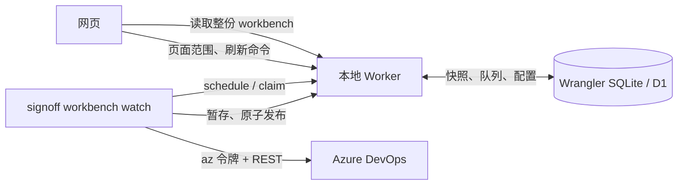
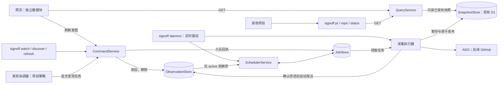

# 14 — 采集、调度与查询：现状和目标

> 状态：待 Review，2026-09-18。已按“显式观察 PR 列表”的最新要求修订。本文与 15–18 是下一阶段设计，尚未实现。
> 当前行为以 [11 — 真实 PR 采集](11-真实PR采集与本地工作台.md)、[13 — 成员与贡献统计](13-成员目录与PR贡献统计.md) 和下列代码为依据。本次先提交文档，评审后再按 TDD 实现。

## 1. 需要解决的问题

SignOff 需要把已发现的 PR 提供给网页和其他项目的 CLI，并持续刷新用户明确加入“观察列表”的 PR。观察项可以由任何消费者添加或移除；刷新模块只接收规范化的观察项，不关心它来自网页、CLI 还是别的项目。

一次查询的含义是“把已经知道的事实交给我”；一次刷新命令的含义是“请安排更新”。新鲜度由实际采集时间说明，不能把查询时间当成数据更新时间。

本期仍以 ADO PR 为真实来源；GitHub 使用同一查询契约，真实 GitHub 工作台采集另行接入。Activity / Score、工作项采集以及 `pulse` 的直接 GitHub 查询保留独立用途。

## 2. 既有系统实际如何工作

| 职责 | 当前实现与证据 | 当前限制 |
| --- | --- | --- |
| 调度触发 | [`watchCollections`](../apps/collect/src/workbench/run.ts) 分别驱动 list / details 循环 | CLI 空闲时每 3 秒调用 Worker；它并非独立的查询服务 |
| 调度决策 | [`refresh.ts`](../packages/worker/src/routes/refresh.ts) 内的 SQL 与 HTTP handler | 冷却、页面租约、轮次结算与路由耦合；details 的目标由单个网页视图决定 |
| 源站采集 | [`ado.ts`](../apps/collect/src/workbench/ado.ts)、[`ado/client.ts`](../apps/collect/src/ado/client.ts) | ADO 真实接入；认证检查发生在采集执行路径 |
| 发布与恢复 | [`collection.ts`](../packages/worker/src/routes/collection.ts) | 已有暂存、120 秒任务租约、项目 revision 校验、失败保留旧快照，应该保留 |
| 网页查询 | [`workbenchRoute`](../packages/worker/src/routes/workbench.ts) | GET 已经只读数据库，但把项目、PR、历史、任务、连接状态和队列放在一个响应里；PR 最多返回 1,000 条 |
| 网页状态 | [`useWorkbenchViewModel`](../apps/web/src/viewmodels/useWorkbenchViewModel.ts) | 一个全局数据请求和大 ViewModel 承担多个块；列表筛选和分页在客户端完成 |
| 统计 | [`useContributionModule`](../apps/web/src/viewmodels/useContributionModule.ts)、[`insights.ts`](../packages/worker/src/routes/insights.ts) | 已经按模块保存并手动重算，可沿用这一隔离方式 |
| 对外 CLI | [`main.ts`](../apps/collect/src/main.ts) | 只有 workbench 采集命令，没有已发布 PR 快照的稳定查询命令 |

当前 list 在网页关闭后仍采集，默认整轮完成后冷却 120 秒；details 默认冷却 300 秒，但没有前台页面就暂停。已有 GET 不会等待 ADO。目标将“发现哪些 PR”“持续观察哪些 PR”“何时查询已有数据”拆开。

### 数据存放位置

| 数据 | 当前位置 | 目标处理 |
| --- | --- | --- |
| 项目、仓库范围、Readiness 设置 | D1 `projects` | 保留为产品配置 |
| provider 仓库身份与别名 | 当前主要随 PR 快照携带，缺少独立完整目录 | 增加本地仓库目录；零 PR 仓库也保存身份，命令只在本地解析引用 |
| 已发布 PR 与检查 | D1 `pull_requests` | 作为网页和 CLI 共用的最新快照存储 |
| 任务、暂存、采集历史、连接心跳 | `collection_jobs` / `collection_staging` / `scan_runs` / `collector_heartbeat` | 保留原子发布与恢复能力 |
| 两组队列与网页视图 | `collection_refresh` | 提取调度模块；状态刷新范围改由持久观察列表提供 |
| PR 观察列表 | 当前没有独立数据模型 | 新增 ObservationStore，保存目标、有效代次、启停与淘汰原因 |
| 成员关系与统计计算 | 目录相关表、`pr_stat_snapshots` | 保留，统计继续手动刷新 |
| Activity 采集原始文件、游标、bootstrap | `SIGNOFF_DATA_DIR`，默认 `.data` | 属于旧活动管线，不用作 PR Query 缓存 |
| ADO 凭据 | Azure CLI 凭据缓存、采集器内存 | 只供采集执行使用 |

本地数据库由 Wrangler 管理，默认路径为 `.wrangler/state/v3/d1/miniflare-D1DatabaseObject/*.sqlite`，仓库迁移现到 `0018`。线上仍使用 D1；本提案不涉及远端部署。

## 3. 推荐的目标结构

CLI 拆成两个用途明确的模块：常驻的调度与采集入口，以及短命的查询与命令客户端。对外服务复用现有 Worker：网页和新 CLI 调用同一个 QueryService / CommandService，不增加第二个 HTTP 端口。

这是模块边界与运行职责的拆分。刷新模块按观察列表安排状态刷新，也执行外围明确提交的发现任务；它自己不枚举项目、决定发现范围或自动把发现结果加入观察。事务仍在 D1 所在的服务端完成。关闭 Vite 或网页不会停止已观察 PR 的刷新；停止采集器后，Worker 仍可提供已有快照。

为延续现有默认 2 分钟发现一次项目 PR 的行为，发现策略保留在独立的 DiscoveryController：它按项目配置和完成后的冷却提交 discover 命令，也可以关闭自动发现，只由网页按钮 / CLI 按需提交。它与刷新模块可以运行在同一 daemon 进程中，不需要增加进程或中间件。**刷新模块自身没有发现定时器。**

### 缓存选择

推荐先复用 D1 作为 SnapshotStore。它已经保存最新快照，服务重启后仍能查询，而且目录和统计需要持久数据。测试注入内存实现；正式实现无需再维护一份独立、可能与网页不一致的内存真相源。以后若读取性能证明需要，可在 QueryService 内按数据版本增加可丢弃的内存缓存。

这个部署选择意味着：**其他项目查询时需要本机 Worker 可用，不需要网页、采集器、`az` 或 ADO 登录可用。** 本期不制作脱离 Worker 的单文件守护进程。

### 依赖约束

| 模块 | 允许依赖 | 不能发生的副作用 |
| --- | --- | --- |
| QueryService / 查询 CLI | 只读 SnapshotReader / ObservationReader、共享领域计算、HTTP/输出适配器 | 不能领取任务、续租、调用 provider、检查 `az` 登录或因缓存缺失自动刷新 |
| CommandService | 输入校验、本地目标解析、ObservationStore、JobStore | 不能同步执行采集，也不能等待 ADO 返回 |
| DiscoveryController | 项目发现配置、时钟、发现任务结果、命令端口 | 不决定哪些 PR 进入持续观察列表 |
| SchedulerService | active 观察项、显式任务、时钟与租约状态 | 不从项目全集、搜索结果或当前页面推导持续刷新范围 |
| 采集执行器 | 已领取任务、provider、发布端口 | 只有持有有效租约和项目 revision 时才能发布 |
| Web 数据块 | Query API、明确的命令、各自 ViewModel | 一个块失败不能清空其他块，也不能隐藏自动采集错误 |

沿用直接的 TypeScript 函数与窄接口。将时钟、provider、存储、输出注入测试，不增加消息中间件或新的数据库。

## 4. 本轮评审需要注意的行为变化

1. **持续刷新只覆盖观察列表。** 网页通过多选和批量操作添加 / 移除，CLI 使用相同 API。发现结果、页面可见性和查询频率都不能自动改变观察列表；默认不含 Draft 的列表筛选也不等于禁止显式观察 Draft。
2. **轮次按项目隔离。** list 与 checks 各自按项目结算，某组织登录过期不会冻结另一项目的周期。界面仍显示两组队列，组进度为各项目状态的汇总。
3. **本机读写接口采用同一信任边界。** 新 CLI 默认连接 `http://127.0.0.1:37042`，无需 Access 或 pipeline token，也不读取 Azure 凭据。设计有意信任能访问该端口的本机进程：它们可以读取缓存、增删观察、注册仓库及提交任务。回环绑定与 Host 校验是实现验收要求，尚未由本文证明；生产网页保持现有 Access 契约。
4. **数据时间与完整性是接口的一部分。** 查询返回源 PR 时间、列表采集时间、检查采集时间、有效性和缺失原因。“最新”表示最后已发布的观测，不保证查询瞬间的源站状态。
5. **外部查询默认 Live。** 网页保留原有默认来源规则；脚本必须明确请求 Sample 才会得到示例，不能因 Live 暂不可用而自动回退。
6. **确认终态后自动淘汰。** ADO `completed` 映射为 merged，`abandoned` 映射为 closed；成功采集确认后，从 active 观察列表移除并取消后续刷新，保留最终快照及原因。手动移除同样停止后续刷新，不删除 PR 数据。重新打开的 PR 需要再次显式加入。
7. **首版只保存本地可解析的观察身份。** 推荐先注册并发现仓库，再加入所需 PR；仓库 ID 已知时，PR 本身可以尚无缓存。仓库身份尚未知则返回 `REFERENCE_UNRESOLVED`，由调用者显式 discover。这是本稿为简化身份竞争提出的范围，待本次评审确认。
8. **项目操作的含义明确区分。** 暂停自动发现不停止已观察 PR；删除项目或移除仓库范围，在项目配置事务中停用对应观察项并取消旧任务。项目删除继续遵循现有 PR 数据删除语义，保留自足的停止记录供解释，详见 16。

## 5. 阅读顺序与文档职责

| 文档 | 评审内容 |
| --- | --- |
| [15 — 网页查询与数据块](15-web-query-contract.md) | 多选观察、主动移除、数据块边界、加载与错误恢复 |
| [16 — 调度状态机](16-scheduler-state-machine.md) | 观察列表、按需发现、冷却、淘汰、去重与恢复 |
| [17 — 查询周期与新鲜度](17-query-cadence.md) | 三种周期的区别、时间字段、离线与过期处理、轮询示例 |
| [18 — CLI 对外查询契约](18-cli-query-contract.md) | 命令、筛选、JSON、身份、分页、退出码和其他项目接入 |

## 6. 实现顺序与原子化提交

以下均为评审后的计划，每步先加入能失败的行为测试，再实现并验证。直接在 `main` 提交，每个提交带对应测试和文档更新，保留全部历史。

| 顺序 | 原子改动 | 涉及现有路径 / 拟新增路径 | 验收 |
| --- | --- | --- | --- |
| 1 | 固定 PR 引用、观察列表与 Query DTO | `packages/domain/src/workbench.ts`、拟新增 `packages/domain/src/query.ts` 与 `observations.ts` | 身份、时间、幂等、观察状态与查询无副作用测试 |
| 2 | 提取调度决策，保持现有发布事务 | `packages/worker/src/routes/refresh.ts`、拟新增 `packages/worker/src/lib/collection-scheduler.ts` 与 `packages/domain/src/scheduler.ts` | 既有调度回归仍通过；假时钟与真实 SQLite 各有覆盖 |
| 3 | 引入仓库目录、观察存储、状态刷新与自动淘汰 | `apps/collect/src/workbench/run.ts`、Worker 采集服务、`packages/db/migrations/` 的下一号迁移 | 零 PR 仓库身份、只刷新观察项、无网页运行、跨项目隔离、项目变更与移除 / 重加竞争 |
| 4 | 增加独立 Query / Command 与发现协调器 | 拟新增 `packages/worker/src/lib/query-service.ts`、`routes/query.ts`、`routes/commands.ts`；CLI 发现协调模块 | 缓存读取、观察增删、按需发现、原子分页、无 provider 调用 |
| 5 | 增加外部查询 CLI | `apps/collect/src/main.ts`、拟新增 `apps/collect/src/query/` | 无 Azure 登录的真实 CLI 子进程与 JSON / 退出码测试 |
| 6 | 网页独立数据块与多选观察 | `apps/web/src/models/workbenchApi.ts`、`viewmodels/WorkbenchProvider.tsx`、`useWorkbenchViewModel.ts`、`usePageCollection.ts`、对应页面 | 批量添加 / 移除、淘汰同步、单块失败、来源隔离；停止页面心跳驱动采集 |
| 7 | 收尾兼容入口与运行文档 | CLI help、README、11、13、15–18 | 从全新临时状态走完 daemon → query → enqueue → publish；确认旧命令兼容 |

阶段迁移保留 `/api/workbench`，直到网页完成切换。`workbench watch` 迁移为新 daemon 的兼容入口；`workbench sync` 的旧“全量检查全部 PR”行为必须明确迁移为发现操作并给出说明，不能保留绕过观察列表的隐藏入口。首次升级的观察列表为空，不把历史 PR 或当前页自动加入。原有 Activity 的 `collect / ingest / settings / doctor` 保留独立用途。

顺序 1–2 只建立契约和内部模块，不开放依赖仓库目录的 URL 命令。顺序 3 的目录持久化和 discover 元数据写入完成后，才能交付顺序 4–6 的引用解析；新仓库必须先注册并成功发现其身份，再接受 URL / number 形式的观察添加。

## 7. 测试如何锁住架构

| 维度 | 计划证据 | 当前状态 |
| --- | --- | --- |
| L1 | QueryService 只注入 reader；provider 调用设置为失败哨兵；假时钟测试慢任务、冷却和恢复；新增逻辑四项覆盖率均至少 95% | planned；既有包覆盖率差距见 [CLAUDE.md](../CLAUDE.md) |
| L2 | 临时 Worker / SQLite 的真实 HTTP；新 Query / Command 全部路由、分页、事务和租约；provider 被阻塞时查询仍完成 | planned |
| L3 | 无 `az` / `gh`、无 token 的 CLI 子进程；网页批量观察 / 移除与自动淘汰；重启采集器时持续查询 | planned；现有浏览器验收为 manual |
| G1 | `bun run lint`、`bun run typecheck`；检查查询依赖图不存在通向采集执行器的路径 | 既有严格分析可运行，完整门禁差距见手册；新边界检查 planned |
| G2 | `bun run security`，保留 OSV 与 gitleaks 必需检查 | enforced，沿用现有门禁 |
| D1 测试隔离 | 每次独立临时目录、端口、SQLite 与浏览器上下文；测试写入前校验 marker / 所有权，禁止复用日常开发数据 | 新系统验收 planned；既有 shell E2E 的隔离缺口不视作已解决 |

这些是验收要求，不是本次文档阶段已经通过的测试。详细状态机用例在 16，网页用例在 15，CLI 用例在 18。
