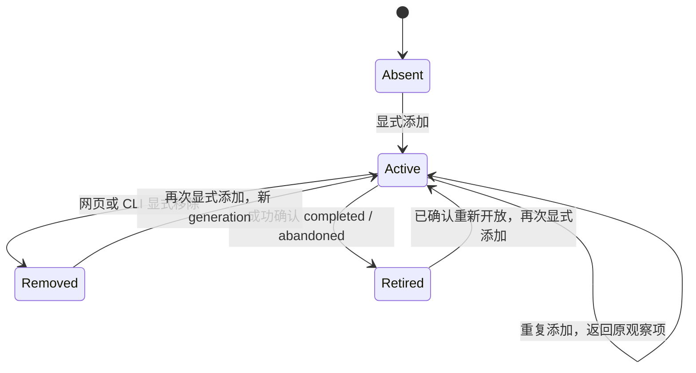

# 16 — 观察列表、刷新调度与自动淘汰

> 当前实现，2026-09-18。网页和 CLI 共用一份关注清单；升级默认空清单，发现仅按需执行。
> 总览见 [14](14-collector-architecture.md)，周期见 [17](17-query-cadence.md)，对外 API / CLI 见 [18](18-cli-query-contract.md)。

## 1. 刷新模块只接收两类输入

1. **active 观察列表**：对列表内的 PR 按配置持续刷新，不关心是谁加入的，也不根据当前页面、搜索或项目全集扩充它。
2. **显式任务**：执行其他模块提交的仓库发现任务，或对 active 观察项提前刷新。发现完成只更新 PR 缓存，不自动加入观察。

发现只由网页、CLI 或外部模块显式提交；本期没有自动发现计时器。默认关注清单为空，启动和查询不会检查源站登录或生成任务。刷新模块不读取项目全集来生成发现目标。

查询模块只有只读端口。所有加入、移除、发现和提前刷新都通过明确的命令 API；不能把 GET、打开页面或缓存缺失变成命令。

## 2. 观察项的数据模型

清单存入 D1 `pr_observations`，由迁移 0019 创建。测试使用独立 SQLite；服务重启后清单和任务保留。

| 字段 | 用途 |
| --- | --- |
| `id` | 观察项身份，与 PR ID、任务 ID 分开 |
| `source` | Live / Sample 隔离；内部可继续使用 cli / demo |
| `ref` | 自足的 provider、organization、project、provider repository ID、PR number / 源 URL，供定向采集；加入前已通过本地仓库目录解析 |
| `pullId` | 已有规范 PR 的内部 ID；首次结果之前可以为空 |
| `generation` | 每次由未观察变为 active 时递增；停止保留该代次，阻止旧任务或迟到删除影响后来重新添加的一代 |
| `active` | 是否属于当前刷新列表 |
| `addedAt` / `stoppedAt` | 当前一代加入时间、停止时间 |
| `stopReason` | null、manual、completed、abandoned、project_deleted、scope_changed |

为保持首版简单，观察存储只接收已解析的稳定身份，不建立临时 URL 身份和后续合并流程。唯一键为 `[source, provider, normalizedOrganization, normalizedProject, providerRepositoryId, PR number]` 的规范编码；active 与 inactive 共用同一行，重新加入只推进该行 generation。

URL 去掉可选末尾斜杠，严格解析路径，拒绝查询参数、fragment、用户信息和其他主机；ADO 的组织 / 项目以及本地目录中的仓库别名按其大小写规则匹配，PR number 使用规范正整数。`pullId`、仓库名称 URL 和 GUID URL 最终都必须在本地解析成同一个唯一键。

并发 add 使用数据库唯一约束与条件写：不存在则插入 generation 1，已 active 返回原行，已 inactive 则只有一次条件更新能激活下一代。失败竞争者重新读取结果，不再建立第二项。观察变更与首个 queued refresh 任务在同一事务提交，回执包含 observation ID / generation 与 job ID；任一写入失败则该项整体回滚，不会只保存观察而漏掉首个任务。重复添加不重置冷却、不制造第二份工作，有同代次未结束任务时返回复用回执，否则 job 为 null。

**当前支持的引用**：支持已缓存 PR ID，以及仓库身份已在本地目录中、但 PR 本身尚未缓存的完整 URL。此时保存待首次结果项，`pullId` 可空，但 repository ID 已知。未注册范围返回 `REPOSITORY_NOT_TRACKED`；已注册但尚无仓库身份返回 `REFERENCE_UNRESOLVED`，调用者先显式 discover。发现必须保存仓库元数据，即使该仓库有零条 PR；不能靠 PR 列表反推唯一的仓库目录。

这些校验不访问 provider、不隐式修改项目范围；刷新核心只接收有效的规范引用，不依赖调用者类型或页面。保留的旧 `enabled` 字段不控制监控清单或显式发现。

### 项目配置变化

| 项目操作 | 观察 / 任务处理 | 查询结果 |
| --- | --- | --- |
| 改名称、负责人或 Readiness | 保留观察范围和代次；不改源身份 | 返回更新后的元数据 / Readiness |
| 删除项目 | 同一项目 CAS 事务内停用其 active 观察项、记录 project_deleted、取消旧任务，再执行现有项目 / PR 删除 | `watch list --include-stopped` 保留自足 ref 与停止原因，pull 可为空；job 为 canceled，reason 为 project_deleted |
| 移除仓库或改变 org / project 来源 | 同一 CAS 事务内停用不再属于新范围的观察项、记录 scope_changed、取消旧工作；仍在范围内的观察项保留，新范围不自动加入 | 受影响项停止，新代次必须明确添加；旧任务为 canceled / scope_changed |

项目命令在 JavaScript 中统一比较 Unicode 大小写和仓库别名，将新范围解析成稳定 provider repository ID。迁移 0020 的触发器只接受绑定本次旧 / 新 revision 的解析结果；旧结果不能用于下一次变更。缓存清理、扫描清理和项目更新的每条 SQL 都重复旧 revision 与解析时的完整仓库目录条件，目录或配置并发变化返回 409，整次不生效；无关 PR 发布或扫描时间更新不阻止配置修改。等价大小写编辑、仓库改名后的元数据编辑均保留有效观察及其 generation。

旧 claim 不能在项目变更后发布或重新激活观察。项目页已移除旧启停按钮。单纯移除观察或终态淘汰保留 PR 快照；用户删除项目本身仍遵循其已有的数据删除语义；任务 canceled 摘要和自足观察记录不会随项目外键级联删除。

## 3. 观察生命周期



- 新加入立即获得首次刷新资格，由队列在已有运行任务之后安排；API 不等待源站结果。
- 临时选择、页面隐藏、关闭、分页、筛选与查询均不改变 active 集合。观察持续到显式移除或成功确认终态。
- Draft 可以显式观察。Draft 默认不显示只是查询筛选，刷新模块不能偷偷排除已加入的 Draft。
- 已缓存为终态时拒绝再次加入，除非后来成功的发现确认它已重新开放。不要因陈旧页面点击而恢复终态 PR 的持续刷新。
- 手动移除保留 PR 快照、最后采集时间和终止原因。对同一代次重复移除是幂等成功；针对旧代次的移除返回冲突，不影响新一代。
- inactive 记录首版不设置自动清理期限，与 active 共用一条规范 PR 记录；重新加入覆盖该行当前一代的启停字段，不保留逐代事件历史。“观察列表”查询默认只返回 active，includeStopped 返回所有保留行，按规范身份稳定排序、分页；lookup 总是查询该行当前 generation，与列表筛选无关。

Sample 的观察记录单独隔离，只在现有本地 demo 模式允许写入，由示例执行逻辑演示状态变化。Sample 项永远不能发起真实 ADO / GitHub 请求。

## 4. 任务范围与冷却

| 工作 | 谁决定范围和时机 | 执行器负责的内容 |
| --- | --- | --- |
| discover / 内部 list | 网页 / CLI 明确命令，提供项目或仓库范围 | 全部可访问 PR 分页（含 Draft、Completed、Abandoned）；不请求 policy / build / timeline |
| refresh / 内部 checks | Scheduler 从 active 观察项安排，或收到针对 active 项的提前刷新命令 | 定向读取 PR、review、policy、status、build、stage |

发现结果与观察列表是两个集合。观察列表为空时仍可执行显式发现任务，但绝不自行产生 checks。缓存里有 1,000 个 PR、观察列表只有 3 个时，周期 checks 的目标就是这 3 个。

保留“整轮完成后才计冷却”：checks 默认 300 秒，按 `(source, 外部项目身份, checks)` 隔离轮次；发现没有自动冷却轮次，只执行显式请求。不同项目可以独立推进，某组织登录过期不冻结别的项目。

### 发现任务的单位

一次 discover 是“一个项目内明确的仓库范围”。CLI 的 `--repo` 只生成单仓库范围；网页可按项目生成任务，把当前仓库列表（或用户明确配置的 all 范围）和 revision 固定进任务。all 范围的仓库枚举也是这项明确发现任务的执行内容，不是刷新模块自主生成工作。

同项目注册另一 URL 扩展已有配置，已配置 all 的项目保持 all。去重键包括项目 revision 和规范化仓库范围，仅相同范围的未结束任务复用；不同范围由同项目租约顺序执行。发现没有自动轮次；首次解析仓库后保存固定 provider ID 计划，重领不会重新扩大仓库列表。

上游仓库改名但 provider ID 未变时，用该 ID 已保存的名称别名验证项目配置范围，接受新名称并保留旧名称。旧 URL、新 URL、GUID URL 和缓存 PR ID 都解析到同一个观察身份；不能把不同 provider ID 当成原仓库接纳。

`job get` 返回每仓库的 state、PR 数量与错误。一个仓库失败时，成功仓库的完整结果可以按仓库边界原子发布，失败仓库保留旧数据；任务整体为 partial / failed，不能标成全成功。发现任务不会自行安排下一轮。配置改变使旧范围任务取消，新 revision 的发现轮次重新建立。

取消未终结任务时，配置 CAS / 取消事务立即将其置为 canceled，优先于尚未结算的 partial / failed；不等待在途请求结束。已成功或失败的仓库结果保留原 state，未结束的仓库标 canceled。先前已发布的仓库结果不因任务取消回滚，但项目删除 / 来源替换本身仍按其数据删除语义生效。迟到结果被 lease / revision / 终态条件拒绝；已经终结的任务不被后来的配置操作改写。

```text
roundCompletedAt = 本轮剩余有效目标全部结束后的最晚完成时间
nextDueAt        = roundCompletedAt + cooldownSeconds
```

每轮开始固定观察项及 generation。新加入项获得单独的首次刷新资格，不无限扩充正在运行的轮次；移除 / 淘汰会取消该代次未开始的工作并从待完成目标中结算。任务较慢时不会按固定 interval 叠加下一轮。

后台观察项不受网页 20 条页大小限制，按单 PR 任务和已有上传字节限制分批执行。每个项目同时最多一个采集任务，到期的显式发现任务可在两个 PR 刷新之间执行；PR 按等待次序推进，不再使用网页可见性或 45 秒页面租约控制采集。

| 情况 | 规则 |
| --- | --- |
| 首次 / 重启 | 读取持久观察项和任务；已到期开始一轮，不补跑每个错过的时间点 |
| 重复 schedule | 不建立第二轮或重复的同代次 PR 工作 |
| 重复 refresh 命令 | 复用 queued / running / auth_required 的同代次工作；回执说明是否复用 |
| 自动冷却改为 0 | 停止新自动轮次；观察列表仍保留，明确的手动刷新仍可执行 |
| 一项失败 / partial | 结束该次尝试，保留旧快照，其他目标继续；失败不等于退出观察 |
| auth_required | 对应项目等待有界认证恢复；其他项目独立运行，观察项不删除 |
| 提前刷新 | 可以越过自动冷却，仍受去重、租约和 provider 退避限制；不重置无关轮次的完成时间 |

## 5. 自动淘汰与在途竞争

ADO `completed` 规范化为 merged，`abandoned` 规范化为 closed。只有成功解析的源站终态事实才能自动淘汰；未来 GitHub 使用同一规范终态，但本期不宣称真实 GitHub 采集已支持。

执行器提交终态时，在同一事务中发布最终 PR 快照、停用任务绑定的观察代次并取消其后续未开始任务。最终快照仍可被网页、CLI 和手动统计读取。

终态证据必须包含规范 PR 身份、源状态、成功观测时间、任务 / lease token、项目 revision、读取时的 PR 快照版本，以及 `(observationId, generation)`。refresh 从创建 / 领取时绑定的观察项获取它；discover 在**实际领取时**，从其明确仓库范围内的 active 观察项建立只读绑定清单，同时记录各 PR 的已有快照版本，未有快照记为 0。复用 running discover 不扩展这份清单；重新领取使用新 lease 并重新绑定。

发布 / 淘汰要求任务 lease 与项目 revision 有效，源事实对应同一 PR 且是明确终态，待写 PR 版本仍等于读取版本，观察仍 active 且 generation 匹配。PR 版本已变化时拒绝旧事实，后续重新采集；已绑定观察被移除或代次改变时，在 staging 和最终发布两处拒绝旧结果，既不覆盖快照也不淘汰新一代。discover 对不在领取时清单内的 PR 可以发布基础数据，但无权移除后来加入的观察项，由它自己的后续 refresh 确认。Query 不负责惰性淘汰。

单 PR refresh 只绑定自己的目标和 generation，不复制仓库全部历史。发现发布在数据库内校验暂存数量和覆盖信息，不把整仓历史快照读入 Worker；仅详情任务读取单个暂存快照来更新 merge requirements。

以下均不能当作 completed / abandoned：PR 没出现在本轮发现列表、403、404、网络错误、token 过期、返回空内容、policy 失败。它们保留观察项并记录错误，后续按恢复策略处理。

移除时先在存储中停用当前 generation，再取消旧工作；停止保留代次以支持重复移除幂等，重新加入才推进 generation。已经发出的 HTTP 请求可能收尾，但调度不会为旧代次发起下一次请求；取消信号尽力终止未开始的后续 provider 请求。发布必须重新校验 active、generation、任务租约和配置 revision。

必须处理这一顺序：`旧刷新开始 → 用户移除 → 用户重新添加 → 旧刷新返回 completed`。旧结果不得关闭新观察项，也不得冒充新一代采集完成。更新 / 淘汰与新代次发布使用同一套数据库条件，不能只在内存里检查一次。

## 6. 发布与恢复保留的保证

沿用 [`collection.ts`](../packages/worker/src/routes/collection.ts) 的 staged publication：暂存、验证数量与大小，再以 D1 batch 原子发布。任务租约保持 120 秒，执行期间续租；观察代次校验加入既有租约与 revision 条件。

- list 不完整枚举不能发布成空仓库；失败仓库与未返回记录的旧快照保留，不根据缺席推断终态。
- head / target SHA 或目标分支变化使检查失效，未知检查不能变成 ready；复用检查时保留其原始观测时间。
- partial 保留已经取得的事实与缺失原因，不能补造 policy 成功、stage、计数或时间。
- 停止进程先停止领取，再有限等待收尾；租约过期后重新领取，旧 token 不能发布。
- 认证只在执行器处理，按组织 / 租户隔离；沿用有效期检查、接近过期续期、401 一次重试与 403 区分。
- 认证任务按 15、30、60 秒退避；普通错误结束尝试，等待下一检查轮次或明确命令。ADO HTTP 层对暂时性错误有界重试，限流尊重 `Retry-After`。重试失败不改变成功观测时间。

## 7. 必须先失败的测试矩阵

| 组别 | 验收行为 |
| --- | --- |
| 来源无关 | 同一规范输入来自网页、CLI、测试客户端，生成完全相同的观察项和任务 |
| 范围隔离 | 空观察列表不产生 checks；发现 1,000 条不会自动观察；观察 3 条只定向刷新这 3 条；无网页时仍运行 |
| 添加 / 删除 | URL / pullId 归一到同一唯一键，并发只激活一次；仓库身份已知的未缓存 PR 可加入；未知身份零写入；200 项不受 20 条限制 |
| 淘汰 | completed、abandoned 原子发布终态并退出；最终快照保留；Draft / 403 / 404 / 空列表 / 认证失败不淘汰 |
| 竞争 | 移除与 claim、移除与发布、移除后重加与旧终态、发现与新观察代次交错；旧工作不能删除或覆盖新一代 |
| 时钟 | 最后一项完成后计时；移除目标能结束本轮；新加入不使旧轮无限延长；慢任务不重叠；重启不补跑 |
| 外围发现 | 刷新模块单独运行没有发现调用；单仓库命令不扩大范围；多仓库部分失败明确报告；重领保留仓库计划 |
| 只读边界 | Query 零任务、零观察写入、零 provider 调用；命令回执在 provider 被阻塞时仍返回 |
| 恢复 | 租约抢占、认证过期、429、项目来源改变；旧数据保留，其他项目继续，查询可用 |
| 项目生命周期 | 删除 / 范围修改原子停止对应项与旧任务；CAS 失败全部保持原状 |
| 真实并发 | 两个独立 SQLite 连接竞争 add / remove / claim / publish，不能靠单连接 mock 代替 |

实现与测试位于 `packages/worker/src/monitoring/{observations,scheduler,publication}.ts` 及同名测试，HTTP 薄适配器见 `routes/collector-adapter.test.ts`。执行器见 `apps/collect/src/workbench/run.test.ts`，ADO 与发布回归仍保留；旧页面心跳改为 410。
