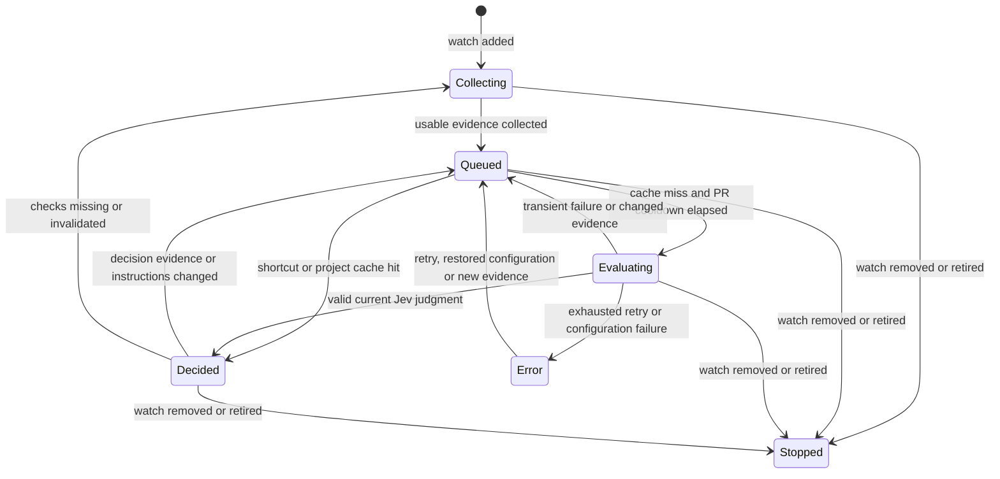

# Evidence-driven readiness

SignOff collects facts, asks Jev for a developer's next-state judgment, and serves the persisted recommendation to the web and CLI. The UI layout is unchanged. Classification never authorizes a provider write.

## Layers

1. **Collection:** existing project discovery and watched-PR detail lanes publish provider snapshots. Discovery defaults to 10 minutes per project; full details default to 5 minutes per PR after completion. Raw checks, build stages, review identities and timestamps remain available for verification.
2. **Evidence:** `packages/domain/src/readiness-evidence.ts` projects a snapshot into one canonical decision model. Logical requirements share a `requirements → facts` hierarchy. Policy conclusions and build execution are separate facts within the same requirement. Equal facts are deduplicated, while conflicting conclusions remain visible. Project descriptions, repository overrides and user priority are resolved before inference.
3. **Decision:** `packages/worker/src/ai/decision.ts` owns currentness, shortcuts, lifecycle phase and cooldown calculation. The scheduler coordinates work; `jev.ts` handles the typed HTTP boundary. Web list/detail and HTTP/CLI observations consume the same currentness projection without doing inference.

Provider conflicts on watched main-target PRs remain an immediate **Conflict** shortcut. Non-main targets remain **Skipped**. Neither invokes Jev. Other readiness categories are exclusively Jev choices: Attention, Review Needed, Warning, Running, Ready and Waiting. Review Needed is the review-only deficit after successful unexpired builds; Waiting describes queued non-review work. Running describes active automatic progress or insufficient signal for a blocker. CI failure is evidence for classification, not an inference Error. Unknown/pending is an operational absence of a current judgment.

## Minimal decision input

Each request contains exactly one PR's decision state and one Choice question: “Act as this PR's developer. Which state describes what I should do now?” English category definitions accompany the question. State contains:

- Lifecycle, draft and mergeability; collection coverage and check validity.
- Exact approval count/remaining requirement, requested changes and pending required reviewers.
- Ordered logical policy/build requirements: stable policy code, name, kind, user explanation when present, and concise facts.
- Each policy's conclusion (`satisfied` / `unsatisfied`, or its ongoing/unknown state), required/enabled/applicable evidence, explicit expiry and independently reported build-currentness; review thresholds where available. An unmet policy condition is distinct from a failed build execution or a reviewer requesting code changes.
- Each associated build's overall outcome, required flag and precomputed commit match (`match`, `mismatch`, `unknown`).

PR IDs/numbers/titles, reviewer names, raw hashes, observation clocks, request IDs, stage/task details, logs and generated action strings are excluded. Distinct PRs can therefore have identical semantic inputs. Raw detail remains in the collector cache and inspection API. Project policy instructions are preserved verbatim; the system never invents business meaning from a name. `isExpired` remains distinct from `buildIsNotCurrent`. Missing facts remain unknown rather than being converted to false.

## Cache and scheduling

The existing local Wrangler SQLite database contains `ai_decision_cache`, partitioned by project ID. Its primary key is `(project_id, fingerprint)`. The fingerprint hashes canonical evidence and the effective instructions/priorities, model and rubric version. The cache stores both the exact decision state and the typed judgment. It has no clock-based expiry: age alone does not change a semantic decision. The separate 12-hour operational-history retention is unchanged.

A watch's `ai_evaluations` row attaches a judgment to its generation and decision input. Unchanged states make no Jev request. Returning to an earlier state, rewatching a PR, or another PR reaching an identical state in the same project can reuse the persisted cache, including after a process restart. Projects never share judgments. Credential replacement does not invalidate a correct paid judgment; changed instructions/model/rubric produce different keys. Failures are not cached as classifications.

The existing daemon invokes the scheduler in the background. A global SQLite lease prevents overlapping ticks; each tick dispatches at most **three independent single-PR requests concurrently**. Equal project/input keys coalesce into one request. Each PR's request cooldown defaults to **300 seconds after completion**, configurable in Connector details. A slow PR does not hold another PR's cooldown. Cache hits do not wait for or consume request cooldown. Transient failures retry at most three times, respecting both retry backoff and PR cooldown. No full-project batched question path remains.

Watch generation, input revision and lease tokens fence writes. Raw publications increment an input revision without forcing a visible readiness reset. On completion the scheduler rereads the current semantic evidence and attaches a result only when it still matches. The final conditional write fences publications that race with this recheck. Results for obsolete evidence can populate their own cache key but cannot overwrite the current watch's judgment. Removing a watch prevents future work for that generation; rewatching creates a new generation. Claims also check credential revision, preventing a configuration replaced or cleared during preparation from dispatching. Completion clocks include preparation time and survive rejected result writes.

## Serving and provenance

Queries are SELECT-only and never request ADO or Jev. A shared semantic comparison immediately marks a saved result historical when evidence/instructions change, even before the next scheduler tick. Stage details and poll clocks do not cause that transition. The table continues showing the last result and its next-action template with the existing compact update indicator.

Observation schema version 2 retains its readiness/next-action contract and adds `readiness.phase`, `model`, `rubric`, `fingerprint` and `reusedAt`. `evaluatedAt` remains the original model judgment time; `reusedAt` is the cache attachment time. `fingerprint` identifies the displayed judgment, which may be historical when `isCurrent:false`. Raw PR/check observation clocks, coverage and source validity remain independent. `isCurrent` means consistency with cached decision evidence and effective instructions, not that the source was just queried. No duplicate compact evidence payload is added to inspection responses.

`GET /api/ai/schedule` reports per-PR eligibility in `pulls`; `projects` contains aggregate request history/token usage, not a project cooldown or batch size. Web list/detail, collection lists and cached CLI output share the same persisted judgments. No merge, approval, rerun or policy bypass is performed.

## Validation

Deterministic SQLite/HTTP tests exercise watched-only scheduling, missing/invalidated evidence, single-question requests, three-request concurrency, cache reuse/isolation, A–B–A transitions, generation changes, unchanged poll/stage details, instruction changes, completion cooldown, typed errors and stale responses. Browser coverage preserves the historical-result indicator and responsive table layout. Live-model results are reported separately from mocked behavior.

For the 11 watched PRs sampled locally during implementation, serialized decision state decreased from a mean of 19,125 to 5,668 bytes (70% smaller) with the same default rule text. Bytes are not billed tokens; the provider's returned token usage is recorded independently. This sample is a payload-size observation, not a classification-accuracy claim.

Local acceptance on 2026-09-22:

- `bun run test:coverage --concurrency=1` passed all seven workspace gates, with `TURBO_ENV_MODE=loose VITEST_MAX_WORKERS=2` limiting local test load. Lint, typecheck and build passed. All 13 isolated Playwright E2E scenarios passed.
- The actual HTTPS application loaded at 1440px and 390px widths, including reload and Connector cooldown settings, without page errors or document overflow. Existing table scrolling and layout were preserved.
- HTTP observations and cached CLI watch output returned identical readiness and next actions for all 11 current watches. Two subsequent scheduler ticks returned `processed:false` and added zero Jev requests.
- Real configured Jev requests used one PR and one Choice. Rubric `signoff-evidence-v7` returned Running for sampled active builds and Attention for a sampled failed build. A recorded request used 2,814 input tokens and 61 output tokens. Credentials, private snapshots and provider responses remain outside Git.

Compact evidence initially caused active-build and review-only samples with unmet review compliance or deferred PoP to receive Attention. Rubric v7 clarified prerequisite order, but the compact input still used `failed` for both an unmet policy condition and a failed build execution. Controlled live counterfactuals showed that removing the build-currentness flag did not fix a review-only sample, while satisfying its review-compliance condition did.

Rubric `signoff-evidence-v8` uses `satisfied` / `unsatisfied` for completed policy conclusions and explicitly distinguishes them from build execution and requested changes. The original provider statuses remain unchanged in cached facts and the inspection API. Six sampled live inputs and two synthetic boundary variants matched their expected categories: successful unexpired builds with pending reviews and unmet compliance/deferred PoP became Review Needed; active CI remained Running; actual build failure, unresolved comments, explicit expiry and requested code changes remained Attention. These bounded checks are regression evidence, not an accuracy estimate. No deterministic category override or confidence threshold is used.

The local scheduler subsequently produced 6 Review Needed, 2 Attention, 2 Running and 1 Skipped across the 11 watches. HTTP and CLI results matched, all were current, and two subsequent ticks made zero additional Jev requests. The actual HTTPS table displayed the corrected badge and review action after reload at desktop and compact widths without page errors.
