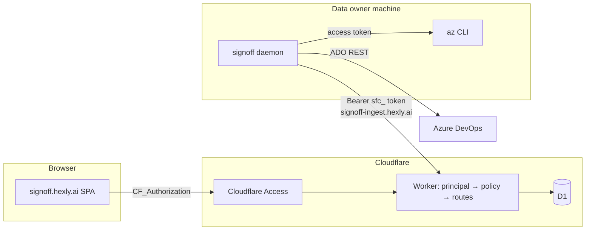

# 23 — Remote access, tenants and connectors

> Status: **M1 implemented** (identity, admins, tenant membership, default-deny
> route policy, admin and waiting pages), 2026-09-24. M2–M5 remain planned.
> Each invariant change lands with the code that needs it, never ahead of it.
>
> M1 deviations from the plan below: only the default tenant exists; the
> `POST /api/insights/:module` recalculation stays a member action (it reads
> cached facts only); migration 0045 guards `projects.tenant_id` with triggers
> because SQLite cannot add a foreign-key column with a non-NULL default.

## Goal

Serve the web and data from the existing Cloudflare deployment
(`signoff.hexly.ai`, Worker + D1), managed securely, while a Connector
installed on a team member's machine uses that machine's `az` session to keep
the deployed data fresh. Data is shared inside a **tenant**; watches are
personal; each project is refreshed by the Connector of its **data owner**.

Non-goals for this phase: Azure deployment, GitHub live collection, remote
query CLI (`signoff pr/watch` against production), compiled installers (M5 is
optional follow-up), per-tenant AI configuration.

## Decisions and assumptions

Confirmed in discussion:

- Stay on Cloudflare Worker + D1.
- A first administrator comes from an environment value; admins manage tenants
  and which Access-authenticated users belong to them.
- PR data, PR state, directory and collections are shared inside a tenant.
  Watches are personal.
- Each project has one data owner, assigned by an admin. Only that owner's
  Connector refreshes the project, covering every PR watched by anyone in the
  tenant.
- Connectors dial out to the Worker; the browser never talks to localhost.

Assumed (confirm during review; marked **A1–A7** where used):

- **A1** Members may edit shared collaborative data: collections, directory
  members / teams / tags, follow and hide.
- **A2** Discovery and Insights *Calculate* (deep discovery) are admin / data
  owner only. Members see who owns the project.
- **A3** A user may belong to several tenants; the web shows a tenant switcher.
- **A4** An ADO project (`provider, organization, project_key`) is registered
  once globally. This is the existing `projects` UNIQUE constraint; two tenants
  cannot register the same ADO project in this phase.
- **A5** AI key, common rules and cooldown stay global and admin-only.
- **A6** Legacy Activity / Score UI and CRUD become admin-only and stay on the
  default tenant; pipeline-token routes are unchanged.
- **A7** The term stays *tenant*. `Workspace` is already a navigation group and
  `teams` is a Directory table.

## Architecture



Every request resolves exactly one **principal**, then one **route policy**
decides. The existing collector protocol (claim, lease renewal, staging,
publication, completion) is reused unchanged apart from ownership checks.

## Identity and authorization

### Principals

| Kind | How it is resolved | Principal key |
| --- | --- | --- |
| `local` | Loopback / `*.dev.hexly.ai` host **and** `SIGNOFF_LOCAL_TRUST=1` | `local` |
| `person` | Verified Access JWT with `email` | `email:<lowercased email>` |
| `service` | Verified Access JWT with `common_name` | `service:<client id>` |
| `connector` | `Authorization: Bearer sfc_…` on the machine host | owner's key + connector ID |
| `pipeline` | Existing pipeline token on the machine host | — (Activity routes only) |
| `anonymous` | Nothing else matched | — |

Local trust currently depends on the Host header alone
(`middleware/entry-control.ts:isLocalhost`). The new flag is set only by
`scripts/dev-worker.ts` and `scripts/test-e2e.ts`, like `SIGNOFF_DEMO_MODE`,
so a production Worker never grants local trust even if a hostname is
misrouted.

### Admins, tenants, members

- `SIGNOFF_ADMIN_EMAILS` is a Worker **secret** (comma-separated). The repository
  is public, so the list is not committed in `wrangler.toml`. Env admins cannot
  be removed through the UI and are the recovery path.
- Additional admins live in `admins(principal, created_by, created_at)`.
- `tenants(id, name, revision, created_at, updated_at)`. Migration creates
  `default` and assigns all existing data to it.
- `tenant_members(tenant_id, principal, added_by, added_at, PRIMARY KEY(tenant_id, principal))`.
  Members are pre-registered by email before their first login; service tokens
  are added as `service:<client id>`, so existing CRUD automation keeps working
  once an admin adds it.
- An Access user without membership gets the `/unassigned` page; every business
  route answers 403. Admins see every tenant.
- Tenant selection: `x-signoff-tenant` request header from the web, validated
  against membership. Default when the principal has exactly one tenant.
  Switching tenant stores the choice and reloads the page, so no query cache
  keys change.

### Permission matrix

| Capability | Admin | Data owner (of project) | Member | Connector | Local |
| --- | --- | --- | --- | --- | --- |
| Tenants, members, admins | ✓ | | | | ✓ |
| Create / delete project, assign data owner | ✓ | | | | ✓ |
| Edit scope, readiness, policy instructions, state machine | ✓ | ✓ | | | ✓ |
| Discovery, Insights Calculate (A2) | ✓ | ✓ | | | ✓ |
| Read PRs, repos, insights, directory, collections, job history | ✓ | ✓ | ✓ | | ✓ |
| Own watches; refresh own watched PRs | ✓ | ✓ | ✓ | | ✓ |
| Collections, directory, follow / hide (A1) | ✓ | ✓ | ✓ | | ✓ |
| Collector cadence, AI settings (A5) | ✓ | | | | ✓ |
| Register / revoke own connectors | ✓ (any) | ✓ | ✓ | | |
| Claim, renew, publish collection jobs; AI tick; avatars | | | | owner's projects | all |
| Activity / Score UI and CRUD (A6) | ✓ | | | | ✓ |

### Route policy is default-deny

`packages/worker/src/route-policy.ts` maps every registered method + path to
one policy: `public | member | owner | admin | connector | pipeline`.
A unit test enumerates Hono's registered routes and fails when a route has no
policy. Handlers stop calling `isLocalhost` for authorization; existing guards
in `routes/ai.ts`, `collection.ts`, `refresh.ts`, `avatars.ts` and
`workbench.ts:projectsScanRoute` move into the table. Browser writes also get
a same-origin check (the pattern already used in `routes/ai.ts`).

## Tenant partition

Everything under `projects` inherits the tenant through `project_id`:
`pull_requests`, `workbench_repositories`, `pr_observations`,
`collection_jobs`, state machines, AI evaluations and caches, and state events.

| Table | Change |
| --- | --- |
| `projects` | `ADD COLUMN tenant_id TEXT NOT NULL DEFAULT 'default'`, `data_owner TEXT` |
| `developers`, `teams`, `tags`, `developer_identities` | `ADD COLUMN tenant_id`; recreate the source-scoped unique indexes with `tenant_id` |
| `pr_collections` + `pr_collection_members` | Rebuild together (UNIQUE is a table constraint; dropping the parent would cascade-delete members) |
| `contributor_blocks`, `pr_stat_snapshots` | Rebuild with `tenant_id` in the primary key |
| `avatar_cache` | Stays global by URL; the read route requires the avatar's organization to belong to a project in the caller's tenant |
| `workbench_revisions`, `directory_revisions` | Unchanged, per source. A change in one tenant invalidates other tenants' cursors, which is conservative and keeps the 41 revision triggers untouched |
| `ai_settings`, `ai_rules` common scope, `collection_refresh` | Global (A5) |

Queries: `storageSource(source)` becomes `DataScope { source, tenantId }` in
`packages/domain/src/monitoring.ts`. Every `source=?` filter (about 100
statements across `monitoring/query.ts`, `routes/directory.ts`,
`routes/insights.ts`, `monitoring/observations.ts`, `routes/pr-collections.ts`,
`routes/avatars.ts`, `routes/state-machines.ts`, `monitoring/collector-groups.ts`,
`ai/*`) adds a tenant predicate, usually through a project join. Observation
identity (`canonicalObservationKey`) gains no tenant field because A4 makes the
ADO project unique already; the join through `project_id` is sufficient.

Deleting a tenant is allowed only when it has no projects or directory rows.

## Personal watches

`pr_observations` stays the shared, tenant-level **collection target**. Its
generation fencing, terminal retirement and job binding are unchanged. A new
table records who wants it:

```sql
CREATE TABLE pr_subscriptions (
  observation_id TEXT NOT NULL REFERENCES pr_observations(id) ON DELETE CASCADE,
  principal TEXT NOT NULL,
  active INTEGER NOT NULL CHECK(active IN (0,1)),
  added_at INTEGER NOT NULL,
  stopped_at INTEGER,
  stop_reason TEXT CHECK(stop_reason IN ('manual','completed','abandoned','project_deleted','scope_changed')),
  PRIMARY KEY(observation_id, principal)
);
```

- **Add**: the existing `addObservation` batch activates the observation if
  needed, then upserts the caller's subscription, guarded by
  `EXISTS (active observation at this generation)`. The response status
  describes the caller's subscription.
- **Remove**: deactivate the caller's subscription, then stop the observation
  `WHERE generation=? AND active=1 AND NOT EXISTS (active subscription)`, in one
  batch. EXISTS keeps it order-independent; the batch never relies on
  `changes()`.
- **Retirement**: trigger `AFTER UPDATE OF active ON pr_observations WHEN NEW.active=0`
  stops remaining subscriptions with the observation's reason. This covers
  terminal publication (`publication.ts`), project deletion and scope-change
  triggers.
- **Queries**: `watched` means the caller has an active subscription; new
  `watchers` is the tenant count; the `watching` filter uses the caller's
  subscriptions. Readiness and refresh apply to any active observation.
- **Migration**: existing active observations get a `local` subscription.
  Before the production deploy, a read-only remote count confirms how many
  exist.

## Data owners and connectors

### Tables

```text
connectors(id, owner, name, platform, version, protocol, created_at, last_seen_at,
           state, message, capabilities_json, revoked_at)
connector_tokens(token_hash PK, connector_id, created_at, expires_at, revoked_at)
connector_device_codes(device_hash PK, user_code UNIQUE, name, platform, version,
           request_ip, request_country, created_at, expires_at,
           approved_by, approved_at, denied_at, connector_id, token_issued_at)
collection_jobs.lease_connector_id  (new column)
```

`collector_heartbeat` (one global row) is migrated into a `local` connector
and dropped. The loopback daemon heartbeats as that connector.

### Device authorization

1. `signoff connector login --server https://signoff-ingest.hexly.ai` calls
   `POST /api/connector/v1/device` (machine host, no auth) with name, platform
   and version. The Worker returns a 32-byte `deviceCode`, an 8-character
   `userCode` (`BCDF…XZ` alphabet, shown `XXXX-XXXX`),
   `verificationUri = ${SIGNOFF_WEB_ORIGIN}/connect?code=…`, `expiresIn: 600`
   and `interval: 5`. At most 50 pending codes exist globally, plus a WAF
   rate-limit rule on this path.
2. The user opens `/connect` behind Access. The page shows the requesting
   machine name, platform, version, IP, country and time, plus a warning to
   approve only codes they started. Approve / deny requires tenant membership
   and a same-origin POST.
3. The CLI polls `POST /api/connector/v1/token` and receives
   `authorization_pending` (428), `slow_down` (429), `access_denied` (403),
   `expired_token` (410) or, once, `{token, connectorId, expiresAt}`.
4. Token: `sfc_` + 32 random bytes base64url. Only its SHA-256 is stored, with
   a 90-day expiry; logging in again creates a new connector. The web lists the
   user's connectors (admins see all) with revoke.

The phishing risk is inherent to device flow: an approved stranger's connector
could claim the approver's projects. That is why the approval page shows
request metadata, codes expire in ten minutes, and tokens are revocable and
scoped to collector routes.

### Routes and credentials

- Machine host (`signoff-ingest.*`) whitelist adds `/api/connector/v1/device`,
  `/api/connector/v1/token`, the `/api/collector/` prefix and
  `POST /api/ai/tick`. `pipelineAuth` never accepts a connector token, and the
  connector resolver never accepts a pipeline token.
- The existing collector paths stay unchanged, so
  `apps/collect/src/workbench/client.ts` only changes its base URL and header.
  Requests carry `x-signoff-connector-protocol: 1`; unsupported versions get 426
  and the daemon stops with an upgrade message instead of retrying.

### Claim routing and lease ownership

- `claimJob` (`monitoring/scheduler.ts`) takes an optional owner. For a
  connector it adds `p.data_owner=? AND EXISTS (tenant_members m WHERE
  m.tenant_id=p.tenant_id AND m.principal=p.data_owner)` inside the existing
  single-UPDATE claim, and records `lease_connector_id`. Local claims all
  projects, as today.
- `renewJob` and every job route (`progress`, `batch`, `repositories`,
  `publish`, `repository-fail`, `complete`, `fail`) require
  `lease_connector_id` to match the caller. Renewal re-checks ownership, so
  reassigning a data owner or removing a member stops the old connector within
  one lease (120 s).
- `scheduleDiscovery` / `scheduleObservations` take the same optional owner, so
  a connector's schedule call only enqueues its owner's projects.
- Projects without a data owner, or whose owner has no connector seen within
  two heartbeat periods, show that state in the web. Queued work stays bounded
  by the existing one-active-job-per-observation guards.
- AI tick from connectors uses the existing runner lease in `ai_settings`.
  `SIGNOFF_AI_ENCRYPTION_KEY` must be a production secret before AI is enabled
  remotely.

### Heartbeat and status

Heartbeat adds `capabilities`:
`{ az: { installed, loggedIn, user? }, gh: { installed, loggedIn } }`, reusing
`apps/collect/src/doctor/az.ts`. `queryCollector` (`monitoring/query.ts`)
reports per-project owner connector state instead of one global heartbeat.

## Connector CLI

- `apps/collect/src/workbench/connector-config.ts`: config at
  `$XDG_CONFIG_HOME/signoff/connector.json` (default `~/.config`), mode 0600,
  holding server origin, connector ID and token. No Keychain access.
- `signoff connector login | status | logout` in `workbench/commands.ts`.
- `signoff daemon` uses the config when present, `--local` forces loopback.
  `collectionApiBase` accepts loopback or the configured HTTPS origin; it still
  rejects credential URLs, paths and redirects.
  `pipeline/client.ts:pipelineRequest` sends the connector token.
- Running from a checkout is enough for this phase:
  `bun run signoff connector login --server https://signoff-ingest.hexly.ai`
  then `bun run dev:collector`.

## Web

- `/api/me` → `{ principal, name, service, admin, tenants: [{id, name}], tenantId }`
  (`routes/me.ts`, `models/entitiesApi.ts:fetchMe`).
- New views: `/unassigned`, Admin → Tenants / Members / Admins, `/connect`,
  Connectors (onboarding commands and the user's connectors). The Projects
  editor gets a data-owner select (admin, tenant members only). Collector status
  shows the owner connector.
- UI hides actions the policy denies; the server remains authoritative.
- `lib/api.ts` adds `x-signoff-tenant`; the sidebar shows the tenant switcher
  when there is more than one tenant.

## Remote D1 fidelity

Local tests run on bun:sqlite (`packages/worker/src/test/sqlite-d1.ts`), which
explicitly does not model D1 limits. Before production collection, the adapter
enforces the D1 limits that matter here: 100 bound parameters per statement,
100 KB SQL per statement, and the per-invocation query budget. Existing suites
must pass under those limits. Publication and claim timings are then measured
once against production D1 during rollout.

## Milestones and atomic commits

Each milestone keeps the product runnable and is deployable on its own. **A push
to `main` deploys production automatically** (Release workflow with remote D1
migrations), so pushes happen only when authorized and only after the rollout
prerequisites for that milestone are set.

**M1 — Identity and admin gate**

1. `feat: resolve request principals` — `middleware/principal.ts`,
   `SIGNOFF_LOCAL_TRUST`, `types.ts`, dev and E2E scripts.
2. `feat: add tenants, members and admins` — `0045_identity_tenants.sql`
   (tables, `projects.tenant_id`), `packages/domain/src/identity.ts`.
3. `feat: enforce default-deny route policy` — `route-policy.ts`,
   `lib/authz.ts`, the local-only handlers migrated, route coverage test.
4. `feat: add admin tenant membership api` — `routes/admin.ts`, `routes/me.ts`.
5. `feat: add admin and unassigned pages` — web models, viewmodels, views, nav.
6. `docs: document identity and admin contract` — docs 12 and 23, AGENTS.md
   access invariants.

Only the default tenant exists; tenant creation is disabled until M4.

**M2 — Remote connectors and data owners**

1. `feat: add connectors and device codes` — `0046_connectors.sql` (tables,
   `projects.data_owner`, `lease_connector_id`, heartbeat migration).
2. `feat: issue connector tokens by device flow` — `connectors/*`,
   `routes/connectors.ts`, machine whitelist, `.gitleaks.toml` rule for `sfc_`.
3. `feat: route collection claims to data owners` — `scheduler.ts`,
   `routes/collection.ts`, lease ownership, owner-scoped scheduling.
4. `feat: report connector status per project` — `queryCollector`, heartbeat
   capabilities.
5. `feat: assign project data owners` — `routes/workbench.ts` and the Projects
   editor.
6. `feat: add connector login to the cli` — config, commands, remote base.
7. `feat: add connect approval and connectors pages`.
8. `test: enforce d1 statement limits in sqlite harness`.
9. `docs: document remote connector contract` — docs 11, 14, 18, README,
   AGENTS.md collection invariant.

**M3 — Personal watches**

1. `feat: add personal watch subscriptions` — `0047_personal_watches.sql`,
   `observations.ts`, `routes/commands.ts`.
2. `feat: show personal watch state` — `monitoring/query.ts`,
   `domain/query.ts`, web watch controls and watcher counts.
3. `docs: document personal watches` — docs 14–16.

**M4 — Tenant partition**

1. `feat: partition directory and collections by tenant` —
   `0048_tenant_partition.sql`, including rebuilds.
2. `refactor: scope queries by tenant` — `DataScope`, all listed routes.
3. `feat: manage tenants and switch tenant` — admin CRUD, header, switcher.
4. `docs: document tenant partition` — docs 01, 13, 20, 22, AGENTS.md identity
   invariants.

**M5 — Distribution (optional follow-up)**: `bun build --compile` targets,
GitHub Release assets, `install.sh` served as a static asset,
`signoff connector service install` (launchd / systemd user unit) and version
gating in the web.

## Production rollout (per milestone)

1. With permission, run read-only remote D1 checks: counts of projects and
   active observations.
2. Before M1: `wrangler secret put SIGNOFF_ADMIN_EMAILS`. Without it, only local
   trust has admin access, and the deployed site fails closed for everyone.
3. Before M2: `SIGNOFF_WEB_ORIGIN = "https://signoff.hexly.ai"` in
   `wrangler.toml [vars]`; a WAF rate-limit rule for
   `signoff-ingest.hexly.ai/api/connector/v1/*`; confirm the Access application
   policy for `signoff.hexly.ai` still bypasses `/api/live` only.
4. Push `main` → CI → Release deploys and applies migrations → `/api/live`
   verify.
5. Acceptance: admin login, add a member, assign a data owner, `connector login`
   from the laptop, daemon heartbeat visible, discovery and watched-PR refresh
   published, a member sees data but not admin actions, revoke stops claims.

## Contract changes

| Current rule | Becomes |
| --- | --- |
| Workbench collection writes only a loopback Worker | Loopback with local trust, or the deployed Worker with a connector token; never the pipeline token |
| Browser Access and pipeline-token routes remain disjoint | Access, pipeline and connector credentials are mutually disjoint |
| Shared persisted watches | Personal subscriptions; observations are tenant-level collection targets |
| Scope identities by source, provider, … | Tenant is part of scope, through the project |
| Loopback trusted by host | Host **and** `SIGNOFF_LOCAL_TRUST=1` |
| Single-instance product (doc 01) | Single deployment, tenant-partitioned |

## 6DQ plan

- **L1**: pure-domain tests for principal keys, the permission function, device
  code state transitions and user-code generation. Web viewmodels for session,
  admin, connectors and connect stay at the 95% four-metric bar. Worker Bun
  suites keep the gap recorded in AGENTS.md; new modules do not add exclusions.
- **L2**: Worker HTTP tests on real SQLite for every new route × principal kind
  (anonymous, non-member, member, owner, admin, service, connector, pipeline,
  local), plus the route-policy completeness test. Concurrency on independent
  connections: two connectors racing a claim; reassignment during renewal;
  last-subscriber removal racing an add; terminal retirement stopping
  subscriptions. A real CLI subprocess runs `connector login` against a local
  Worker with approval issued through the HTTP API, then runs a daemon cycle.
- **L3**: extend `scripts/test-e2e.ts` with a remote-mode lane (no local trust)
  covering connector device flow, owner-routed collection, personal watches and
  tenant isolation. Browser role journeys need a runner-owned Access JWKS stub;
  until that exists, L3 for Access roles stays **planned** and L2 carries the
  role matrix with the injected verifier.
- **G2**: gitleaks rule for `sfc_` tokens; OSV unchanged.
- **D1**: remote-mode E2E uses per-run `--persist-to` and ports like the current
  lane; D1 statement limits are enforced in the SQLite harness.
